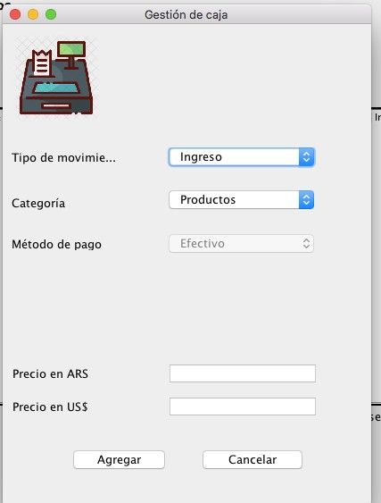

**E Q U I P O	D O P P L E R**

**P E L U M A N Í A**

**M A N U A L	D E	U S U A R I O**

**TOC \o "1-1" \h \z \u [Introducción	3**](#_bookmark0)**

[**Cliente	4**](#_bookmark1)

[**Servicio	5**](#_bookmark2)

[**Producto	6**](#_bookmark3)

[**Profesional	7**](#_bookmark4)

[**Promoción	8**](#_bookmark5)

[**Sucursales	10**](#_bookmark6)

[**Caja	11**](#_bookmark7)

[**Reportes	13**](#_bookmark8)

[**Usuarios	14**](#_bookmark9)

[**Citas	15**](#_bookmark10)

**I N T R O D U C C I Ó N**

El Sistema Pelumania, es un programa de gestión de peluquerías, consta de los siguientes módulos:

Cliente Servicios Productos Profesionales Promociones Sucursales Citas

Caja Reportes Usuarios

El sistema esta disponible en dos idiomas, español e inglés, puede ser elegido con el botón lenguajes, y seleccionar el idioma que desee, debe cerrar el programa, y comenzara a correr el programa en el idioma correspondiente.

**C L I E N T E**

El sistema permite dar de alta, baja y modificar a los clientes, como asignarle estados que son : Activo,Inactivo,Moroso,VIP.

**S E R V I C I O**

El modulo de servicios, consiste en un alta, baja, o modificación de servicios.

**P R O D U C T O**

El modulo de servicios, consiste en un alta, baja, o modificación de Productos.

**P R O F E S I O N A L**

El sistema permite agregar profesionales, como modificarlos o borrarlos. También permite asociar el profesional, a una sucursal, ver los horarios del mismo. También se permite asignar uno o varios servicios.

**P RO M O C I Ó N**

El sistema contempla la creación de promociones, estas tienen un periodo de vigencia, también se le asigna el porcentaje de descuento, como la equivalencia de la puntuación, también se le puede asignar a uno o varios servicios.

El sistema también permite ver las promociones vigentes.

**S U C U R S A L E S**

El sistema permite la generación de distintas sucursales, como también editarlas o borrarlas.

**C A J A**

En el sistema existe el modulo de caja, que nos permite crear categorías de transferencias, que se dividen en Egreso e Ingreso.

Luego se generaran transacciones, en la que el usuario puede ingresar el tipo de movimiento, la categoría y su respectivo método de pago. Después se deben cargar los montos se cargan.

**R E P O R T E S**

El sistema cuenta con reportes de las siguientes : Reporte General

Reporte de Ingresos Reporte de Egreso Sucursal

Servicios

Cliente Profesional Ranking

**U S U A R I O S**

El sistema permite generar usuarios con una sucursal asociada , como los permisos de sistema, los permisos varían entre: Dueño, Supervisor, Recepcionista, Contador.

También el sistema permite cambiar la contraseña de la cuenta del usuario loggeado.

**C I T A S**

El sistema permite generar citas, por defecto la cita se registra en la sucursal en la que esta logrado el usuario ,para crearla se deberá seleccionar una fecha .

Luego es necesario cargar un cliente, este puede ser de los que están cargados en el sistema, donde también la opción de generarlo , o se puede optar por un usuario genérico.

A continuación, deberá proceder a seleccionar el horario del turno. Seguidamente se podrá seleccionar el servicio mediante distintos filtros, Profesional, se muestran los profesionales disponibles en el caso de no haber , se puede utilizar uno genérico, por servicio, que muestra los servicios disponibles, y por las promociones vigentes.

Al final de la cita, Se muestran los datos de la cita, y luego de apretar el botón Confirmar, se generara un comprobante de la cita.

Los estados de las citas varían entre: Activa Verde

En curso Marron Reprogramar Marron Claro Fiada cyan

Cancelada Bordo Finalizada Azul Vencida Gris
